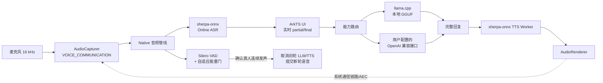
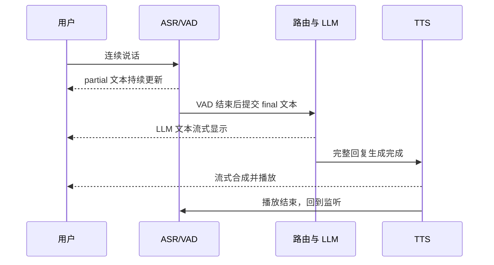
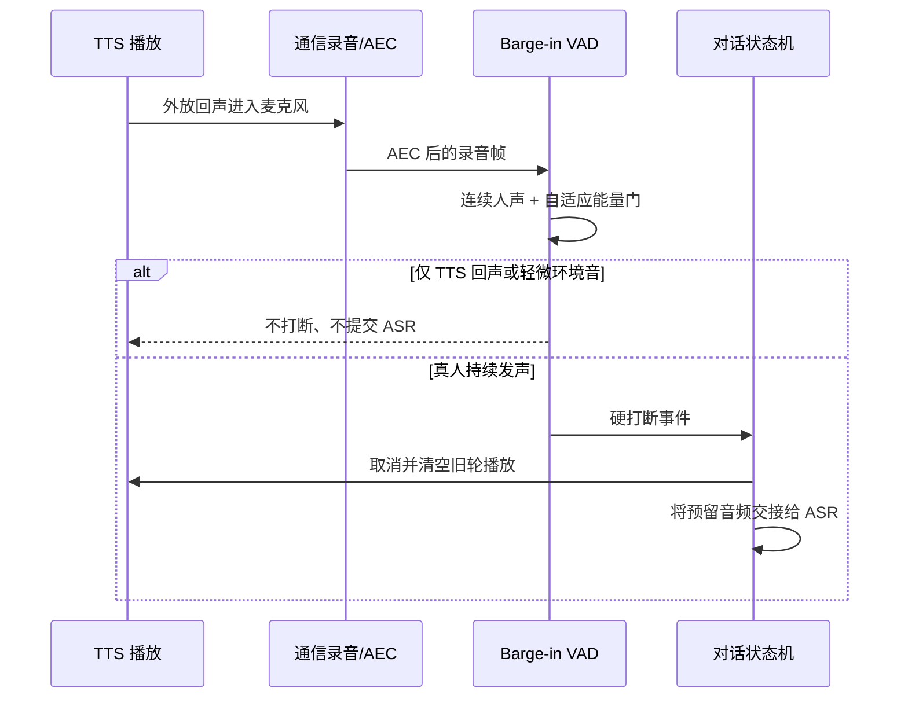
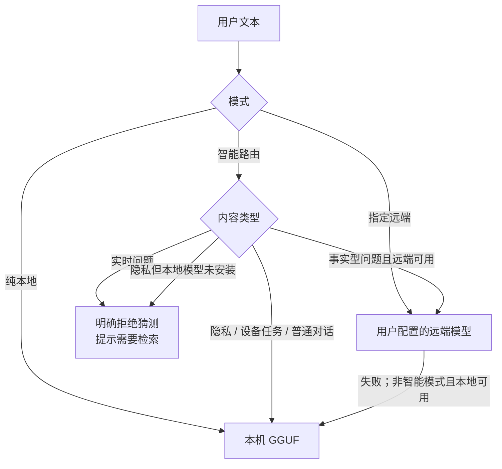

# OHOSNativeAIEngine

HarmonyOS 端侧 AI 语音交互技术原型。项目在手机上串联实时 ASR、VAD 打断、本地 TTS、GGUF 小模型与可选远端模型，重点验证“持续监听、真人可打断、TTS 不自识别、断网可用”的工程实现。

> 当前定位是可运行、可测量、可讲清设计取舍的技术作品，不是通用 AI SDK，也不是已经商业化的语音助手。已验证平台为 HarmonyOS NEXT API 22、arm64 真机。

## 已实现能力

| 能力 | 当前实现 | 边界 |
| --- | --- | --- |
| 实时语音识别 | sherpa-onnx Online ASR，partial 结果实时更新 UI | 普通话效果取决于所配模型和环境 |
| 语音活动检测 | Silero VAD，独立用于 ASR 分段与 TTS barge-in | 不能替代语义级误触发判断 |
| TTS 期间真人打断 | 平台通信录音/AEC 信号 + VAD 连续人声 + 自适应能量门控 | 强回声、外放距离和设备声学差异仍需实机标定 |
| 本地语音合成 | sherpa-onnx 流式 TTS + HarmonyOS AudioRenderer | 稳定版本在 LLM 整轮生成完后开始朗读 |
| 离线 LLM | llama.cpp + Qwen2.5-0.5B-Instruct Q4_K_M GGUF | 0.5B 模型适合短对话与指令，不适合可靠百科问答 |
| 能力路由 | 纯本地 / 智能路由 / 指定远端 | 远端需用户配置 OpenAI 兼容 API 或 Ollama |
| 隐私与事实边界 | 隐私关键词留在本地；时效问题无检索时拒绝猜测 | 当前没有联网检索/RAG，远端 LLM 也不等于事实检索 |
| 可观测与回归 | Native 指标、内存快照、诊断导出、确定性语音回归、真实 GGUF 回归 | 自动回归验证状态机和回调，不替代真实声学测试 |

未实现或未完成验证的内容：唤醒词产品链路、Windows 客户端、GPU/NPU LLM 加速、联网搜索、量产级跨机型声学标定。仓库中的 MediaCodec、Windows 或实验代码不代表这些能力已经交付。

## 系统架构



ArkTS 负责页面、模型下载、路由、会话与 Worker 编排；C++ N-API 负责实时音频、ASR/VAD、TTS 回调、本地 GGUF 推理、状态机和指标采集。ASR 与 TTS 分别运行在 ThreadWorker 中，避免把长任务直接放在 UI 线程。

### 一轮正常对话



当前刻意采用“LLM 完整生成 → TTS”的顺序链路。曾两次尝试让本地 GGUF 和 TTS 并发，但在目标机上产生周期性音频欠载、UI token 批量刷新和多轮状态竞争；稳定性优先于更早开口。

### TTS 中途打断



这里不是“只靠 RMS”或“只靠 VAD”。平台通信录音提供回声抑制基础，VAD 判断人声连续性，自适应能量门抑制残余回声和轻微噪声，状态机负责旧轮取消及新轮所有权。孤立 partial 超时后会被清理，避免污染下一句话。

## LLM 路由



本地模型为 Qwen2.5-0.5B-Instruct Q4_K_M，约 398–491 MB（两个校验过的下载源），运行时执行大小与 SHA-256 校验。Native 上下文为 1024 tokens；为降低端侧 prefill，应用侧默认只保留最近 2 轮压缩历史，本地 prompt 预算约 300 tokens，单次输出上限 160 tokens。

“智能路由”只是本地规则策略，不是搜索引擎。它可以避免将显式隐私内容上传，也会在没有检索能力时拒绝回答实时事实，但不能保证覆盖所有敏感表达。

## 真机性能基线

测试设备：nova 14，12 GB RAM，arm64-v8a，HarmonyOS `TLR-AL00 6.1.0.117(SP8C00E115R10P4)`；Debug HAP；数据采集于 2026-08-03。

| 指标 | 实测结果 | 说明 |
| --- | ---: | --- |
| 本地 GGUF 自然回复 decode | 15.2–17.4 token/s | 同一真机 5 次自然对话样本 |
| 紧凑 prompt 首 token | 1.16–1.24 s | 真实 GGUF 固定输出回归，4 次 Native TTFT |
| 完整语音栈 RSS | 约 1.32–1.35 GB | ASR/TTS/VAD/GGUF 已加载的自然对话会话 |
| 常规 TTS 生成 RTF | 多数 0.80–0.93 | 不包含短片段/预热异常值；RTF < 1 才能持续实时产出 |
| 确定性语音回归 | 33/33 通过 | 验证状态机事件和回调不变量 |
| 真实 GGUF 回归 | 4/4 通过，重复回复 0 | 验证请求隔离、结束回调与跨轮复用 |

这些结果只代表上述设备、模型与 Debug 构建，不应直接外推到其他机型或 Release 包。短输出测试的 token/s 容易失真，因此吞吐采用自然回复样本，固定输出用例只用于观察 TTFT 和回调正确性。

## 工程结构

```text
entry/src/main/ets/
├─ pages/Index.ets               页面、会话与 LLM 路由编排
├─ workers/AsrWorker.ets         录音与 ASR Worker
├─ workers/TtsWorker.ets         TTS 与 AudioRenderer Worker
└─ utils/                        模型生命周期、回归、内存和安全存储

entry/src/main/cpp/
├─ napi_init.cpp                 N-API 与实时语音主链路
├─ audio/                        状态机、AEC/降噪辅助和管线类型
├─ llm/                          GGUF、本地/远端 LLM 抽象
├─ metrics/                      指标与基准采集
└─ third_party/llama.cpp/        llama.cpp Git submodule
```

## 构建与运行

### 环境

- DevEco Studio，并安装 HarmonyOS SDK `6.0.2(22)`
- Node、JBR、Hvigor 使用 DevEco Studio 随附版本
- Python 3（仅模型准备脚本需要）
- arm64 HarmonyOS 手机；当前 `module.json5` 声明的产品形态为 `phone`

首次克隆时需同步第三方子模块：

```bash
git clone --recurse-submodules <repository-url>
```

已经克隆的仓库可执行：

```bash
git submodule update --init --recursive
```

构建配置会对锁定的 llama.cpp 版本幂等应用仓库内的 OHOS 补丁；如子模块版本不匹配，CMake 会明确报错，不会静默使用未验证的上游代码。

### 模型准备

ASR、TTS 和 VAD 模型体积较大，不提交到 Git。先检查本地文件：

```powershell
python scripts/download_models.py --check
```

如项目 Release 已发布对应模型包，可运行：

```powershell
python scripts/download_models.py
```

核心模型应位于 `entry/src/main/resources/rawfile/models/`，构建时会进入 HAP。离线 GGUF 不需要打入 HAP，可在应用的模型设置页下载、断点续传、校验或删除。

### 构建

最简单的方式是使用 DevEco Studio 打开项目、同步依赖并运行 `entry`。命令行等价调用为：

```powershell
<DevEco-Studio>\tools\node\node.exe `
  <DevEco-Studio>\tools\hvigor\bin\hvigorw.js `
  --mode module -p product=default -p module=entry@default `
  -p buildMode=debug assembleHap
```

仓库不保存个人签名证书、口令或绝对路径。需要安装到真机时，请在 DevEco Studio 中为本机重新生成/配置调试签名；不要把生成的 `signingConfigs` 提交到公共仓库。

### 远端模型（可选）

应用不内置任何私人局域网地址或公共 API Key。可以在设置页填写：

- 自建 Ollama：只填 `192.168.x.x` 时会规范化为 `http://192.168.x.x:11434/v1/chat/completions`；手机需能访问该主机。
- OpenAI 兼容服务：填写自己的 HTTPS endpoint、模型名和 API Key。

远端配置加密保存在当前设备应用沙箱中。自签名证书、明文 HTTP 和服务端容量仍由部署者负责。

## 测试

开发者面板提供两类自动化工具：

- 确定性语音回归：快速验证正常轮次、打断、静音、孤儿 partial 清理和状态恢复等逻辑不变量；它使用合成事件，瞬间完成是预期行为。
- 真实 GGUF 回归：实际调用本地模型，检查请求隔离、回调次数、输出终止和重复回复。

声学链路仍需要手工实测，建议至少覆盖：正常连续对话 10 轮、TTS 自然结束后继续说话 10 次、TTS 中途真人打断 10 次、TTS 期间安静/轻微环境音 10 次。

诊断原始数据只保留在本机，不作为源代码提交。对外展示时应把设备、构建类型、模型、样本数和异常值规则一起写入基线文档。

## 关键工程取舍

- 稳定顺序链路：本地 LLM 和 TTS 暂不并发，避免 CPU 争抢导致音频欠载和 UI 卡顿。
- 双层识别：ASR 分段与 TTS 打断共享声学基础，但使用不同确认条件，避免“能识别”直接等于“必须打断”。
- 单轮所有权：打断时取消旧轮生成/播放，并通过状态机与音频交接防止复读、漏发和跨轮污染。
- 有界上下文：限制本地历史和输出长度，降低 0.5B 模型的 prefill 延迟、重复回复概率与长期内存压力。
- 可验证降级：本地/远端切换复用同一会话摘要；对无法核实的实时事实明确暴露能力边界。

## 第三方组件与许可

项目使用 llama.cpp、sherpa-onnx、ONNX Runtime 等第三方组件。各组件保留其原始许可证；发布 HAP 或二次分发模型前，请逐项核对代码、预编译库和模型许可证。当前仓库根目录尚未声明统一的项目许可证，因此不要将本项目标注为 MIT 或其他许可证。
